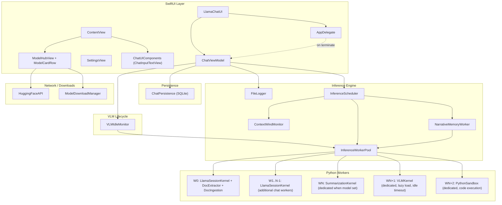
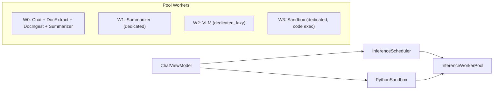
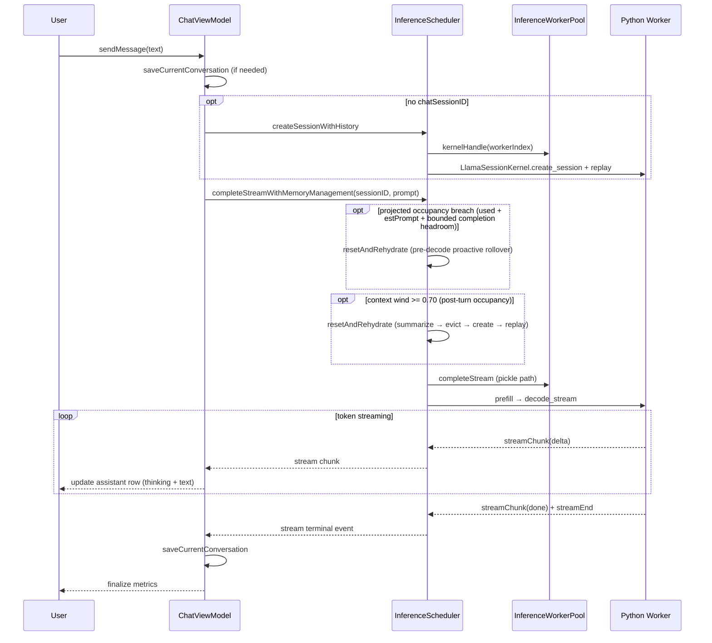
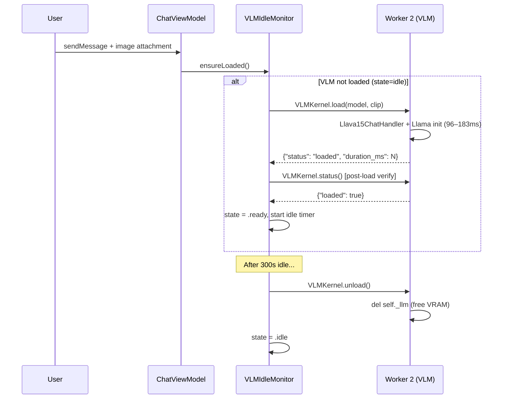
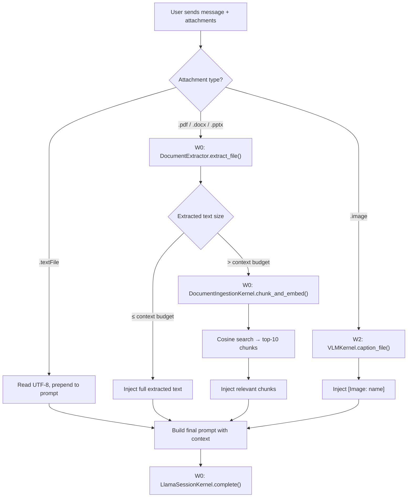
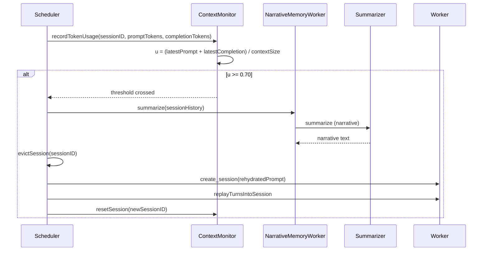

# LlamaInferenceDemo Architecture

Session-affinity inference pipeline for llama.cpp using SwiftPython's multi-process worker pool with DAG-based scheduling, heterogeneous ML kernel orchestration, vision language model (VLM) captioning, document extraction, semantic retrieval, externalized narrative memory, and context wind management.

> **Verified February 12, 2026** — 3 SwiftPythonWorker processes visible in Activity Monitor (W0: chat + doc extraction + ingestion + summarizer, W1: dedicated summarizer, W2: dedicated VLM at 17.64% GPU). Image captioning (Hubble Earth photo → detailed description in 19s), PDF extraction (gas bill → structured summary with line items), and multi-turn chat all confirmed working simultaneously.

## Executables

| Target | Path | Purpose |
|-------|------|---------|
| **LlamaChatUI** | `UI/` | Primary SwiftUI chat app — sidebar, conversations, model discovery; `AppDelegate` handles graceful shutdown |
| **LlamaInferenceDemo** | `App/` | CLI for scenarios (burst, benchmark, script review, adversarial) |

Both use `LlamaInferenceCore` (Sources/) for inference.

## High-Level Architecture



## Worker Layout

Each worker is a separate `SwiftPythonWorker` OS process with its own Python interpreter, GIL, and Metal GPU context. Workers communicate with the Swift host via Unix domain sockets (IPC). This process isolation means any worker can crash and be respawned without affecting others.

```
Workers 0 .. N-1:     LlamaSessionKernel (main chat model, session-affine)
Worker 0 (shared):    DocumentExtractor (MarkItDown, lazy markitdown import)
Worker 0 (shared):    DocumentIngestionKernel (MiniLM embeddings, lazy model load)
Worker 0 or ded.:     SummarizationKernel (shared on W0 or dedicated when summarizerModelPath set)
Worker N+offset:      VLMKernel (DEDICATED — llava chat handler, lazy model load + idle timeout)
Worker N+offset+1:    PythonSandbox (DEDICATED — arbitrary code execution, persistent namespace)
Worker N+offset+2:    VideoKernel (PLANNED — ffmpeg/AVAsset frame extraction + VLM captioning)
Worker N+offset+3:    WebSearchKernel (PLANNED — live web search, results injected into context)
```

**Concrete example (verified config — Activity Monitor screenshot, Feb 12 2026):**

```
W0: LlamaSessionKernel (Qwen3-4B-Q4_K_M) + SummarizationKernel (shared) + DocumentExtractor + DocumentIngestionKernel
W1: SummarizationKernel (dedicated, summarizerModelPath set)
W2: VLMKernel (e.g. SmolVLM-500M or Qwen3-VL, 17.64% GPU time during captioning)
W3: PythonSandbox (code execution, persistent namespace, matplotlib capture)
```



**Why a dedicated VLM worker?** The VLM (e.g. SmolVLM-500M or Qwen3-VL, ~400MB–2GB) loads its own GGUF model and CLIP projection into GPU memory. Running on a dedicated worker means:
- Image captioning runs **in parallel** with chat inference — no blocking
- VLM model can be loaded/unloaded independently without disrupting active chat sessions
- Metal GPU contexts are isolated per process — no resource contention
- Worker crash during VLM load doesn't take down the chat model

**Why a dedicated sandbox worker?** The `PythonSandbox` actor executes arbitrary user code from fenced Python blocks in chat messages. Running on an isolated worker means:
- User code runs **in parallel** with chat inference and VLM — no blocking
- A runaway script (infinite loop, OOM) crashes only the sandbox worker, not chat
- Persistent namespace (REPL-style): variables survive across runs within a session
- Figure capture: matplotlib (Agg → PNG), Plotly (`Figure.to_image`), and PIL/Pillow `Image` instances in the namespace; all rendered inline below the code block
- Jupyter-style output: if the last statement is an expression (e.g. `df.describe()`, `2 + 2`), it is evaluated and its repr is printed
- `ChatViewModel.executeCodeBlock(_:)` returns structured `RunOutput` (stdout, stderr, figures, error, elapsedMs)
- **Fix with AI**: when execution produces an error, the inline output panel offers a one-click button that composes a prompt with the code and traceback and populates the chat composer

**Sandbox scope and security.** The sandbox runs real Python in a dedicated OS process with **no execution restrictions**. Code can use `subprocess`, `os.system`, network I/O, filesystem access, and system APIs (e.g. AppleScript via `osascript`). This is intentional for a local-first app: the user is running code they or their LLM wrote on their own machine. If you need to lock down execution (e.g. restrict subprocess or network), extend `WorkerResourceLimits` or add a policy layer around the sandbox worker; out of the box, the sandbox is full-capability.

## Message Flow (LlamaChatUI)



## What Makes This Architecture Novel

As of February 2026, no existing open-source project or shipped product combines all of these elements:

### 1. Swift-Native Process Pool with Out-of-Process Python Workers

Existing Swift-Python bridges (PythonKit, swift-python) embed CPython in-process. SwiftPython's `PythonProcessPool` runs **isolated worker processes** with:
- Unix domain socket IPC with framed binary protocol
- Handle-based remote object lifetime (PyHandle)
- Shared-memory tensor transport (64KB SHM buffers, zero-pickle)
- Backpressure policies (suspend at max in-flight)
- Automatic crash recovery with respawn budgets
- Per-worker BLAS thread pinning

This is architecturally closer to Chromium's renderer process isolation than any Python-from-Swift approach.

### 2. Heterogeneous Kernel-per-Worker Architecture

Each worker process hosts one or more **specialized Python kernels** with different lifecycle policies:

| Kernel | Worker | GPU | Lifecycle | Purpose |
|--------|--------|-----|-----------|----------|
| LlamaSessionKernel | W0..N-1 | Metal (shared model) | Persistent | Multi-turn chat inference |
| SummarizationKernel | W0 or dedicated | Shares LLM or own model | Persistent | Narrative + graph delta extraction |
| DocumentExtractor | W0 | None | Persistent | PDF/DOCX/PPTX → Markdown (MarkItDown) |
| DocumentIngestionKernel | W0 | None (CPU embeddings) | Lazy load | Chunking + MiniLM-L6-v2 embeddings |
| VLMKernel | Dedicated | Own Metal context | Lazy load + idle timeout | Image captioning (configurable VLM from Settings) |
| MemoryGraphKernel | W0 | None | Persistent | SQLite + sqlite-vec graph store |
| VideoKernel | Dedicated (planned) | None (CPU) | Lazy load | ffmpeg/AVAsset frame extraction → VLM captioning |
| WebSearchKernel | Dedicated (planned) | None (network) | Lazy load | Live web search results injected into chat context |

Ollama and LM Studio run one model per process. This system runs **6 specialized kernels** (+ 2 planned) across a managed pool with different loading strategies.

### 3. VLM with Idle VRAM Management on Dedicated Worker

No local-first chat app implements this lifecycle:
1. User attaches image → VLM lazy-loads on dedicated worker (183ms)
2. Image written to temp file → file path sent over IPC (bypasses 8MB payload limit)
3. Python kernel reads file locally, creates data URI, runs `create_chat_completion`
4. Caption returned to Swift, injected into chat context
5. After configurable idle timeout (300s default), model unloaded to free VRAM
6. Next image triggers re-load

The temp-file IPC bypass is a pragmatic solution: base64-encoded images easily exceed the 8MB IPC frame limit (a 6.9MB PNG becomes 9.2MB in base64). Writing to `/tmp` and passing the path keeps the IPC payload at ~100 bytes.

### 4. Externalized Memory with Context Wind Monitoring

The `ContextWindMonitor` + `SummarizationKernel` + `MemoryGraphKernel` pipeline running alongside inference is unique to this system:
- **Context wind** tracks `u = tokens / contextSize` per session with deterministic thresholds
- At 70% utilization: summarize conversation → extract graph delta → commit to SQLite
- Evict old session → create fresh → rehydrate with narrative summary + semantic retrieval
- `sqlite-vec` enables cosine similarity search over MiniLM embeddings within the graph store
- KV cache is treated as ephemeral working memory; the graph is the authoritative state

### 5. The Closest Alternatives (and How They Differ)

| System | Language | Process Model | Kernels | Memory | VLM |
|--------|----------|---------------|---------|--------|-----|
| **This system** | Swift + Python IPC | Multi-process pool | 7 heterogeneous | Graph + embeddings + rehydration | Dedicated worker, idle VRAM |
| Ollama | Go | One model/process | 1 | None | Primary model only |
| LM Studio | Electron + C++ | Single process | 1 | None | Primary model only |
| PrivateGPT | Python | REST server | ~3 | RAG (no graph) | No |
| Apple MLX Swift | Swift | In-process | 1 | None | No |
| Open WebUI | Python | REST + Docker | ~2 | RAG | Via external API |

---

## Future Roadmap

### VideoKernel (W3 — planned)

Video understanding via frame sampling + VLM captioning:
1. User attaches video → extract N keyframes via `ffmpeg` or `AVAssetImageGenerator`
2. Write frames to `/tmp/video_{UUID}/frame_001.png` ... `frame_N.png`
3. Loop: call `VLMKernel.caption_file()` for each frame on W2 (VLM worker)
4. Concatenate timestamped captions: `[Frame 1 @ 0:00] ... [Frame 2 @ 0:15] ...`
5. Inject timeline of captions into chat prompt
6. Clean up temp frames with `defer`

SmolVLM at 1.3s/frame → 10 frames ≈ 13s. Frame extraction is CPU-only (no GPU). Could optionally batch-summarize frame captions through the chat model for a concise video summary.

### WebSearchKernel (WN — planned)

Live web search to ground the frozen LLM with current information:
1. User enables web search toggle (globe icon)
2. Query extracted from user message → search via `duckduckgo-search` or `searxng`
3. Top-K results fetched, cleaned, and truncated to context budget
4. Injected as `[Web: query]\n<results>` into chat prompt alongside other context sources
5. LLM answers with up-to-date information despite frozen training cutoff

CPU + network only — no GPU, no VRAM, no idle timeout needed. Worker stays warm with HTTP client ready (~30MB RSS).

---

## Design Philosophy: Session Affinity

Instead of migrating KV cache between processes (expensive, fragile), each session is pinned to a single worker. The Swift-side scheduler distributes sessions across workers and uses `ProcessPoolDAG` to coordinate prefill→decode pipelines.

| Approach | KV Cache Location | Cross-Process Cost | GPU Support |
|----------|-------------------|-------------------|-------------|
| **Session Affinity** (ours) | In-place, worker-local | Zero | Metal/CUDA |
| True Prefill/Decode Split | Migrated via serialization | 100ms+ per transfer | GPU memory isolation |

**Key insight:** `llama_copy_state_data` serialization overhead exceeds any benefit from worker specialization.

## Component Breakdown

### InferenceScheduler

**File:** [Sources/Engine/InferenceScheduler.swift](Sources/Engine/InferenceScheduler.swift)

- Session lifecycle (create, evict, LRU)
- Worker assignment (least-loaded)
- DAG batch execution via `ProcessPoolDAG` (pickle path) or shared-memory path (`completeToShm`)
- Streaming decode path via `completeStream` / `completeStreamWithMemoryManagement` (pickle stream chunks, not SHM)
- Token budget tracks latest turn occupancy (`promptTokens + completionTokens`), not cumulative additions
- Proactive projected headroom check before decode (`used + estimatedPrompt + projectedCompletionReserve`) to trigger pre-decode rollover
- Bounded reserve heuristic for projected completion headroom (`min(maxTokens, max(256, 25% of context))`) so large `maxTokens` settings do not force unnecessary reset loops
- Memory management: `completeWithMemoryManagement` / `completeStreamWithMemoryManagement` → `resetAndRehydrate` when utilization >= 0.70

### InferenceWorkerPool

**File:** [Sources/Engine/InferenceWorkerPool.swift](Sources/Engine/InferenceWorkerPool.swift)

- `PythonProcessPool` lifecycle
- Kernel installation: LlamaSessionKernel (per worker), SummarizationKernel (shared or dedicated), DocumentExtractor (W0), DocumentIngestionKernel (W0), VLMKernel (dedicated worker)
- `totalWorkers` = workerCount + (useDedicatedSummarizer ? 1 : 0) + 1 (VLM)
- VLM worker index = workerCount + summarizerOffset (always last)
- venv site-packages injection (auto-discovered via `discoverVenvPath()` — walks up from `#filePath` to find `.venv`)
- Shared-memory result buffers when `useSharedMemory`

### ContextWindMonitor

**File:** [Sources/Engine/ContextWindMonitor.swift](Sources/Engine/ContextWindMonitor.swift)

- Tracks `u = tokens / contextSize` per session
- Thresholds: prepare (0.60), commit (0.70)
- `recordTokenUsage` stores latest decode occupancy (`lastPromptTokens + lastCompletionTokens`) rather than accumulating completion tokens across turns
- `resetSession` after rehydration

### NarrativeMemoryWorker

**File:** [Sources/Engine/MemoryGraphWorker.swift](Sources/Engine/MemoryGraphWorker.swift)

- Calls SummarizationKernel when commit threshold crossed
- Produces narrative summary; rehydration injects `[CONVERSATION SUMMARY]` + recent turns

### FileLogger

**File:** [Sources/Engine/FileLogger.swift](Sources/Engine/FileLogger.swift)

- File-based logger complementing OSLog
- Writes to `~/Library/Application Support/LlamaInferenceDemo/Logs/llama-inference.log`
- Log levels: debug, info, warning, error (from UserDefaults `logLevel`)
- **Policy:** Info = user-audience (app start, model load, errors). Debug = implementation details (sessions, workers, DAG, context wind). **Conversations are never logged.**

### ChatPersistence

**File:** [Storage/ChatPersistence.swift](Storage/ChatPersistence.swift)

- SQLite (FTS5) for conversations and messages
- Path: `~/Library/Application Support/LlamaInferenceDemo/chat.db` or override via Settings
- `saveConversationIncremental(id:title:messages:existingMessageIDs:)` — INSERT new messages, DELETE removed, skip unchanged (used when `lastSavedMessageIDs` is populated)
- `loadMessagesPage(for:limit:beforeSortOrder:)` — cursor-based paginated query (ORDER BY sortOrder DESC LIMIT)
- `countMessages(for:)` — per-conversation message count
- `loadAttachmentReferences(for:)` — ordered flattened attachment metadata used to rebuild mention registries when loading conversations

### DocumentExtractor

**File:** [Sources/Python/DocumentExtractor.swift](Sources/Python/DocumentExtractor.swift)

- Wraps Microsoft MarkItDown for PDF, DOCX, PPTX, XLSX, HTML → Markdown conversion
- Lazy import: `markitdown` loaded on first `extract_file()` call, not at install time
- Two-step install: class definition eval, then separate instantiation eval
- Diagnostic logging: prints `sys.path` on first load for debugging venv issues
- Non-fatal install — graceful fallback if unavailable

### DocumentIngestionKernel

**File:** [Sources/Python/DocumentIngestionKernel.swift](Sources/Python/DocumentIngestionKernel.swift)

- Overlapping text chunking (500 chars, 100 overlap)
- MiniLM (`all-MiniLM-L6-v2`) 384-dim embeddings via `sentence-transformers`
- Cosine similarity search over pre-computed embeddings (top-k retrieval)
- Model loaded lazily on first embed call
- Installed on worker 0, non-fatal

### VLMKernel

**File:** [Sources/Python/VLMKernel.swift](Sources/Python/VLMKernel.swift)

- Wraps `llama-cpp-python`'s `Llava15ChatHandler` for multimodal image+text inference
- `load()` / `unload()` / `caption()` / `caption_file()` / `status()` methods
- `caption_file()` reads image from disk in-process to avoid IPC payload limits (8MB max)
- `_run_caption()` internal helper shared between `caption()` (data URI) and `caption_file()` (file path)
- Model loaded/unloaded independently of the chat LLM
- Installed on **dedicated worker** (not W0) for non-blocking parallel captioning
- Verified with SmolVLM-500M-Instruct-Q8_0 (~417MB) + mmproj-SmolVLM-500M-Instruct-f16 (~190MB)

### PythonSandbox

**File:** [Sources/Engine/PythonSandbox.swift](Sources/Engine/PythonSandbox.swift)

- Runs fenced Python blocks on a dedicated worker and returns structured `RunOutput` (`stdout`, `stderr`, `figures`, `error`, `elapsedMs`)
- Persistent REPL-style namespace across runs; `clearNamespace()` available for reset
- Last-expression capture uses AST rewrite + single `exec(..., globals())` pass to preserve runtime scope
- Temporarily patches `matplotlib.pyplot.show` to no-op during execution so figures remain capturable; restores original `show` afterward
- Captures matplotlib, Plotly, and PIL figures; figure-export failures are surfaced as `[figure capture] ...` lines in stderr
- User-facing errors are sanitized to remove worker-internal wrappers while preserving full logs for diagnostics

### ProcessPool evalResult Namespace Semantics

**File:** [../../Sources/SwiftPythonRuntime/ProcessPool/PythonProcessPool.swift](../../Sources/SwiftPythonRuntime/ProcessPool/PythonProcessPool.swift)

- `wrapEvalResultCode` executes statement and expression paths with `globals()` for both `exec` and `eval`
- Prevents namespace drift where imports/definitions from earlier statements were unavailable to trailing expressions
- Aligns runtime behavior with sandbox execution semantics

### Model Hub

**Files:** [Sources/Network/HuggingFaceAPI.swift](Sources/Network/HuggingFaceAPI.swift), [Sources/Network/ModelDownloadManager.swift](Sources/Network/ModelDownloadManager.swift), [Sources/Models/HubModels.swift](Sources/Models/HubModels.swift), [Sources/Models/ModelHubSearchParser.swift](Sources/Models/ModelHubSearchParser.swift), [UI/ModelHubView.swift](UI/ModelHubView.swift), [UI/ModelCardRow.swift](UI/ModelCardRow.swift), [UI/ModelHubViewModel.swift](UI/ModelHubViewModel.swift), [UI/GGUFModelInfo.swift](UI/GGUFModelInfo.swift), [UI/ModelDiscovery.swift](UI/ModelDiscovery.swift)

Built-in Hugging Face model browser — search, download, and activate GGUF models without leaving the app.

- `HuggingFaceAPI` actor — public REST API client (`/api/models`); search with `&filter=gguf`, model detail with siblings list, file size via HEAD
- `ModelDownloadManager` — `URLSessionDownloadTask` with delegate for chunked progress; downloads to user-configured dir (default `~/Models/gguf/`); also checks HF cache
- `QuantLevel` — parses quant level from GGUF filenames (longest-match-first); 15 levels from Q2_K to bf16
- `GGUFFile.from(sibling:repoId:)` — detects quant level + mmproj from filename
- `ModelRole.suggest(for:isVLMRepo:)` — auto-suggests role (mmproj → VLM Projection, VLM repo → VLM Model, else → Chat Model)
- "Use as" menu writes directly to `UserDefaults` (modelPath / vlmModelPath / vlmClipPath / summarizerModelPath)
- VLM Bundle row has "Use as" when both main + projection downloaded (VLM Model + Projection, Chat Model only)
- `GGUFModelInfo` — parses filenames into user-friendly display names (strips .gguf, quantization); used in capsule, Settings, Model Hub
- `DiscoveredModel.isMMProj` — mmproj files excluded from chat model selectors (capsule, Primary model, Summarizer); shown only in VLM Model / Vision Projection pickers
- `ModelDiscovery` scans user-configured download dir (Settings → Downloads); "Downloaded" filter uses base-name matching for quantized filenames
- Default source filter: `lmstudio-community` (634 models, consistent quantization, clean filenames)
- Debounced search (300ms); curated models on empty search; sort by downloads/likes/recent/name
- Search parser supports inline provider syntax (`@author`) in any order (e.g. `nanbeige @bartowski` and `@bartowski nanbeige`)
- Model Hub results `ScrollView` supports pull-to-refresh with mode-aware reload (downloaded, curated, or active search)
- Model Hub uses a transient live-download snapshot (progress-quantized) so byte-level download updates do not force full results-list reflow while scrolling
- Sidebar download progress strip — active downloads visible while chatting with progress bars; completed files dismissable
- VLM "Download Bundle" — one-click Q4_K_M + mmproj download; prefers Q4_K_M → Q4_K_S → first available

### VLMIdleMonitor

**File:** [Sources/Engine/VLMIdleMonitor.swift](Sources/Engine/VLMIdleMonitor.swift)

- Swift actor managing VLM lifecycle: lazy load on first image, idle timeout to free VRAM
- Configurable idle timeout (default 300s) via `vlmIdleTimeoutSecs` setting
- 30s polling interval; states: `idle` → `loading` → `ready` → `unloading` → `idle`
- **Post-load verification**: after `load()` returns, calls `status()` to confirm worker is alive and model is loaded
- Automatic shutdown on pool teardown

## VLM Image Captioning Pipeline

### Lifecycle (Load / Unload / Idle Timeout)



### Image Data Flow (PNG Conversion → Temp File → IPC → Caption)

The image never crosses the IPC boundary. Only a ~100 byte file path is sent over the Unix domain socket. The Python worker reads, encodes, and processes the image entirely in its own process.

```mermaid
sequenceDiagram
    participant Swift as ChatViewModel (Swift)
    participant NSImg as NSImage / NSBitmapImageRep
    participant TmpFS as /tmp (filesystem)
    participant IPC as Unix Domain Socket (8MB limit)
    participant Py as caption_file() (Python W2)
    participant Llava as Llava15ChatHandler
    participant CLIP as CLIP Projection (Metal GPU)

    Swift->>NSImg: NSImage(data: rawBytes)
    Note over NSImg: Handles HEIC, WebP, TIFF, PNG, JPEG, BMP, GIF
    NSImg->>NSImg: tiffRepresentation → NSBitmapImageRep
    NSImg-->>Swift: PNG bytes via .representation(using: .png)

    Swift->>TmpFS: write PNG bytes (e.g. 6.9MB)
    Note over TmpFS: /tmp/vlm_{UUID}.png

    Swift->>IPC: send file path string (~100 bytes)
    Note over IPC: Only the path crosses IPC, not the image data

    IPC->>Py: caption_file(path="/tmp/vlm_XX.png", mime="image/png")
    Py->>TmpFS: open(file_path, 'rb') → read raw bytes
    Py->>Py: base64.b64encode(raw).decode()
    Py->>Py: build data URI: "data:image/png;base64,{b64}"
    Py->>Llava: create_chat_completion(messages=[{image_url: data_uri}])
    Llava->>Llava: decode base64 → raw bitmap bytes
    Llava->>CLIP: feed bitmap through CLIP projection (mmproj)
    CLIP-->>Llava: image embeddings (64 tokens)
    Llava->>Llava: LLM generates caption from embeddings + prompt
    Llava-->>Py: {"choices": [{"message": {"content": "A red apple..."}}]}
    Py-->>IPC: {"caption": "A red apple...", "tokens": 256, "duration_ms": 1421}
    IPC-->>Swift: VLMCaptionResult

    Swift->>TmpFS: delete temp file (defer)
    Swift->>Swift: inject "[Image: name]\n<caption>" into chat prompt
```

**Why this design?** A 6.9MB PNG becomes 9.2MB in base64 — exceeding the 8MB IPC frame limit. Writing to `/tmp` and passing the path keeps the IPC payload tiny while letting the Python worker handle encoding locally with no size constraints. The PNG conversion step (via `NSImage`) ensures all macOS image formats (HEIC, WebP, TIFF, etc.) are normalized to a format llama-cpp can decode.

## Attachment Processing Flow

When the user sends a message with attachments, the processing depends on attachment type:



## Attachment Mentions and Context Injection

- Explicit mention tokens (`@docs(alias)` / `@img(alias)`) select which prior attachments are injected as context for a turn
- Per-session registries are rebuilt from persistence on conversation load/branch switch via `loadAttachmentReferences(for:)`
- Duplicate filenames get deterministic aliases (`file.pdf`, `file.pdf #2`, ...)
- Unresolved mentions and unreferenced pending attachments show inline non-modal composer warnings
- Attachment-only sends keep the default prompt (`"Describe this."`) and auto-inject only current-turn attachments for that fallback path
- If mentions are used, only referenced attachments are injected (no implicit all-attachments injection)

### ChatUIComponents (ChatInputTextView)

**File:** [ChatUIComponents/ChatInputTextView.swift](ChatUIComponents/ChatInputTextView.swift)

- NSTextView-backed multi-line composer input; fixes SwiftUI `TextField(axis: .vertical)` mouse/trackpad scroll bug on macOS
- Auto-grows from 1 to 8 lines, then scrolls internally via NSScrollView
- Return = send (calls `onSubmit`); Shift+Return = insert newline
- Placeholder when empty; focus restored when model finishes responding
- `SubmitTextView` subclass overrides `keyDown` for key handling; unit-tested in `ChatInputTextViewTests`

### MessageContentView

**File:** [UI/MessageContentView.swift](UI/MessageContentView.swift)

- Renders markdown (headers, bold, lists, code blocks, blockquotes) and LaTeX math in chat messages
- `MarkdownRenderCache` — NSCache-backed LRU (500 entries), keyed by message UUID
- `LatexPreprocessor` — normalizes delimiters (`$$...$$` and `\[...\]` to fenced `math` blocks, `\(...\)` and `$`...`$` to `$...$`), escapes likely currency dollars, normalizes markdown-escaped subscripts (`\_` -> `_`) inside inline math, strips unsupported style commands (`\displaystyle`, `\textstyle`), rewrites unsupported outer-accent forms (`\hat{\mathbf{x}}`, `\vec{\mathbf{x}}` -> `\mathbf{\hat{x}}`, `\mathbf{\vec{x}}`), replaces unsupported `\Box` with `□`, heals truncated inline spans per-line (odd unescaped `$` + single trailing `\`), de-indents accidental indented math lines so markdown does not treat them as code blocks, and protects markdown control chars before parse (excluding `_` to preserve TeX subscripts). Fenced code blocks are left untouched by these heals.
- Uses `Textual` structured rendering with markdown math syntax extension (`.math`) for inline + block equations
- Text selection/copy stays enabled via Textual (`.textual.textSelection(.enabled)`)
- Python code execution actions resolve source from Textual `CodeBlockProxy` first (authoritative rendered code), with parser/tracker fallback only if proxy extraction fails

### App Termination / Graceful Shutdown

**File:** [UI/AppDelegate.swift](UI/AppDelegate.swift)

Uses the macOS `applicationShouldTerminate` / `terminateLater` / `reply` pattern so the main thread is never blocked during cleanup:

1. `applicationShouldTerminate(_ sender:)` returns `.terminateLater`, deferring termination.
2. A `@MainActor` Task runs `flushPendingSave()` and `shutdownPoolIfNeeded()` asynchronously.
3. On completion, `sender.reply(toApplicationShouldTerminate: true)` allows the app to quit.
4. Worker processes (SwiftPythonWorker) receive shutdown and exit; no orphaned processes after quit.

The view model is passed to the delegate via `@NSApplicationDelegateAdaptor` and `.onAppear { appDelegate.viewModel = viewModel }`.

### ChatViewModel (Persistence Flow)

- **Dirty flag** — `lastSavedMessageIDs` avoids redundant writes when conversation unchanged
- **Deferred save** — 300ms debounce via `deferSave()`; rapid switching cancels intermediate saves; `flushPendingSave()` on terminate (invoked by AppDelegate)
- **Optimistic switch** — `selectConversation` updates UI immediately; loads messages in background; `isLoadingMessages` shows loading indicator
- **Pagination** — initial load 50 messages; `loadMoreMessages()` prepends older pages; `hasMoreMessages` enables "Load earlier messages"
- **Mention hydration** — session attachment aliases are rebuilt from persisted attachment records when loading/switching/branching conversations; cleared on new chat and pool shutdown
- **Context retry guard** — on recoverable context-window errors, `_sendMessage` performs one silent `resetAndRehydrate(...)` retry before surfacing an error

### LlamaSessionManager

**File:** [Sources/Engine/LlamaSessionManager.swift](Sources/Engine/LlamaSessionManager.swift)

- Legacy direct path (no DAG). Used by CLI scenarios (script review, etc.), not by LlamaChatUI.

## Context Wind / Rehydration Flow

`completeStreamWithMemoryManagement(...)` first runs a proactive projected occupancy check (`tokenBudgetUsed + estimatedPrompt + bounded completion reserve`). If it predicts context overflow, it rehydrates before issuing prefill/decode. The post-turn context wind threshold path below still applies for utilization-based commits.



## Logging and Encrypted Debug Logs (Future)

### Current Logging Policy

- **Info (default):** App started, model loaded, errors, model load failures
- **Debug:** Session lifecycle, worker indices, DAG/SHM, context wind, memory management
- **Never logged:** User prompts, model outputs, conversation content

Settings UI includes: "Logs include app events and errors. Debug adds technical details. Conversations are never logged."

### Encrypted Debug Logs (Planned)

**Goal:** Allow debug logs for support without exposing implementation details to anyone who enables debug.

**Flow:** Same as today — user opens log folder and emails the file. They see ciphertext for debug lines; developers decrypt with private key and read full output.

**Technical design:**

1. **Key:** Asymmetric. Public key in app for encryption; private key only on developer side. Extracting public key from binary does not enable decryption.

2. **Format:** Info / Warning / Error stay plain. Debug lines:
   ```
   [2026-02-11T10:00:00.000Z] [DEBUG] [Scheduler] ENC:j8fK2mNp...base64...
   ```
   `ENC:` marks encrypted lines for the decoder.

3. **Crypto (CryptoKit):** Hybrid scheme — per-line random AES-256 key, encrypt payload with AES, encrypt AES key with developer's public key. Store `{encrypted_payload, encrypted_key}` (e.g. concatenated, Base64) in log line.

4. **Decryption tool:** Small CLI run locally. Input: log file. Output: log with debug lines decrypted. Private key never leaves developer machine.

5. **User-facing:** In Settings: "Debug logs are encrypted. To share with support, send the log file to developers@swiftpython.dev"

**Tradeoffs:** Barrier for casual readers; support workflow unchanged. Does not prevent determined reverse-engineering of the app, but prevents "enable debug and read the log."

## Configuration

### InferenceConfig

| Field | Default | Description |
|-------|---------|-------------|
| `modelPath` | (required) | Path to GGUF model file |
| `summarizerModelPath` | nil | Optional dedicated summarizer model |
| `contextSize` | 4096 | Context window; Settings UI offers 2,048–131,072 (128k) |
| `nGpuLayers` | -1 | GPU layers (Metal) |
| `workerCount` | 2 | Main model workers |
| `useSharedMemory` | true | SHM for result transport |

### SamplingParams

| Field | Default |
|-------|---------|
| `maxTokens` | 512 |
| `temperature` | 0.7 |
| `topP` | 0.95 |
| `topK` | 40 |
| `repeatPenalty` | 1.1 |

## Testing

All tests live in `Tests/` under a single `LlamaInferenceDemoTests` target:

- **LlamaInferenceDemoTests:** Session types, JSON parsing, scheduler stats, sampling params, inference config
- **FileLoggerTests:** Log levels, plain/JSON format, rotation, no user content
- **ChatPersistenceTests:** Persistence, search, FTS5, attachments (26 tests)
- **ChatInputTextViewTests:** Return sends, Shift+Return newline, placeholder (5 tests)
- **DocumentExtractorTests:** Install, text extraction, PDF extraction, error handling, venv discovery (5 tests)
- **ModelHubTests:** Quant level detection, GGUF file parsing, mmproj detection, VLM bundle separation, model role suggestion, HF API JSON decoding, download task progress (21 tests)
- **MentionResolutionTests:** Mention token parsing, aliasing, composer suggestion insertion, unresolved-warning behavior
- **MemoryArchitectureE2ETests:** Context wind, narrative memory, rehydration, multi-turn pipeline, latest-turn occupancy semantics, projected-headroom rollover checks

```bash
swift test --package-path Demo/LlamaInferenceDemo
swift test --package-path Demo/LlamaInferenceDemo --filter FileLoggerTests
swift test --package-path Demo/LlamaInferenceDemo --filter ChatInputTextViewTests
```

## Troubleshooting

### Model Load Fails

**Symptom:** `ModelLoadFailed: llama_cpp import failed`

**Fix:** Ensure `llama-cpp-python` in your Python environment:
```bash
pip install llama-cpp-python
```

### Context Overflow

**Symptom:** `InferenceError.contextOverflow(sessionID:used:max:)`

**Cause:** Session token budget exceeded. Increase context size in Settings or use shorter prompts.

### Worker Crash

**Symptom:** `PythonWorkerError.poolShuttingDown`

**Fix:** Check worker logs, reduce `maxSessionsPerWorker`, set `maxMemoryBytesPerWorker`.

## Shared Memory (Phase 4)

When `useSharedMemory` is true (default):

- Each session gets a 64KB shared-memory result buffer
- Python `complete_to_shm` / `decode_to_shm` write JSON into the buffer
- Swift reads via `withSharedBuffer` — no pickle round-trip
- Layout: `[4 bytes LE length][N bytes UTF-8 JSON]`

**Files:** [LlamaSessionKernel.swift](Sources/Python/LlamaSessionKernel.swift) (`completeToShm`, `decodeToShm`), [InferenceScheduler.swift](Sources/Engine/InferenceScheduler.swift) (`completeViaShm`), [InferenceWorkerPool.swift](Sources/Engine/InferenceWorkerPool.swift) (`getOrCreateResultBuffer`)

## JSON Bridge Pattern (methodResult)

Python kernel methods return `json.dumps(result_dict)` — not raw dicts. Swift parses:

```swift
let jsonString: String = try await pool.methodResult(handle: kernel, name: "create_session", ...)
let result = try LlamaSessionKernel.parseJSON(jsonString)
```

See [BUGFIX.md](BUGFIX.md) for the TypeError diagnostic that led to this pattern.

## References

- [SwiftPython ProcessPool API](../../docs/wiki/API-Concurrency-and-Handles.md)
- [llama-cpp-python](https://github.com/abetlen/llama-cpp-python)
